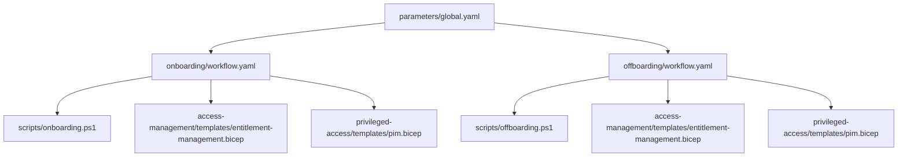

## Employment Hero → Entra API-driven Inbound Provisioning

This project integrates Employment Hero (HR system) with Microsoft Entra Lifecycle Workflows using the API-driven inbound provisioning model.

- **Automation flow:**  
  1. Extracts workforce data from Employment Hero via API.  
  2. Transforms data to SCIM schema.  
  3. Uploads to Entra via the `/bulkUpload` endpoint for the configured provisioning app.  
  4. Triggers onboarding workflows based on mapped attributes (e.g., `employeeHireDate`).

- **Implementation:**  
  - See [`onboarding/scripts/employment-hero-to-entra-bulkupload.ps1`](onboarding/scripts/employment-hero-to-entra-bulkupload.ps1) for the integration script.
  - The deployment pipeline runs this script before onboarding workflow deployment ([`.github/workflows/deploy-onboarding.yaml`](.github/workflows/deploy-onboarding.yaml)).

- **References:**  
  - [API-driven inbound provisioning concepts](https://learn.microsoft.com/en-us/entra/identity/app-provisioning/inbound-provisioning-api-concepts#end-to-end-flow)  
  - [Bulk upload endpoint](https://learn.microsoft.com/en-us/graph/api/synchronization-synchronizationjob-post-bulkupload)  
  - [Plan cloud HR provisioning](https://learn.microsoft.com/en-us/entra/identity/app-provisioning/plan-cloud-hr-provision)  
  - [Employment Hero API](https://developer.employmenthero.com/reference/get-employees)
# LifecycleWorkflow
## Microsoft Entra Lifecycle Workflows: Modular Configuration-as-Code Design

### Directory Structure

```
entra-lifecycle-config/
├── README.md
├── parameters/
│   ├── global.yaml
│   ├── roles.yaml
│   └── environments/
│       ├── dev.yaml
│       ├── prod.yaml
│       └── test.yaml
├── onboarding/
│   ├── workflow.yaml
│   ├── scripts/
│   │   └── onboarding.ps1
│   └── templates/
│       └── user-onboarding.bicep
├── offboarding/
│   ├── workflow.yaml
│   ├── scripts/
│   │   └── offboarding.ps1
│   └── templates/
│       └── user-offboarding.bicep
├── access-management/
│   ├── entitlements.yaml
│   ├── access-reviews.yaml
│   └── templates/
│       └── entitlement-management.bicep
├── privileged-access/
│   ├── pim.yaml
│   ├── access-reviews.yaml
│   └── templates/
│       └── pim.bicep
└── docs/
    ├── structure.md
    ├── parameterization.md
    └── usage-examples.md
```

### File Formats

- **YAML**: Configuration, parameters, workflow definitions.
- **PowerShell (.ps1)**: Automation scripts.
- **Bicep**: Azure resource provisioning.
- **Markdown**: Documentation.

### Parameterization & Reusability

- Centralized parameters in `parameters/` (global, roles, environments).
- YAML anchors/references for DRY configuration.
- Templates reference parameters via variables or input files.

### Documentation

- `docs/structure.md`: Explains structure.
- `docs/parameterization.md`: Parameter usage.
- `docs/usage-examples.md`: Sample scenarios.

### Modularity & Versioning

- Each workflow is self-contained, referencing shared parameters/templates.
- GitHub tracks changes per file for PR-based reviews and rollbacks.
- Environment-specific configs enable safe testing and staged rollouts.

### Mermaid Diagram



This structure supports user onboarding/offboarding automation, job role-based access, access lifecycle management, and privileged access lifecycle, with clear modularity, parameterization, and documentation for reusability and version control.